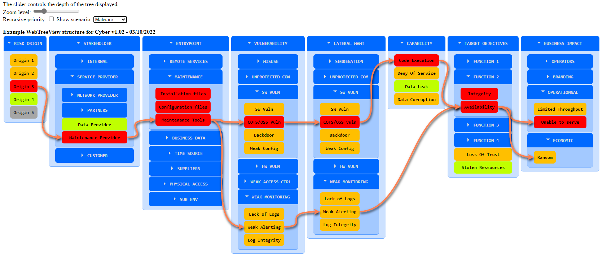

# WebTreeView

Generate an HTML view of a tree organized set of data from an excel file.
Originally created for cybersecurity attack paths visualization.

## Getting started

The Excel file is used for creating the information tree.
The VBA macro inside (button "Generate HTML") creates a WebView.html file in the same directory based on the provided WebViewTemplate.html file.
The Macro.bas file of this repository is already in the Excel file. It's only exported here to ease configuration control.

The Excel file already contains a working example.

The resulting HTML file can be displayed in Thales Wiki (with the help of the Html-bobswift object).

## Usage

Git clone the repository or download TreeSample.xlsm and WebViewTemplate.html.

Open TreeSample.xlsm in Excel\
Enable Macros\
!!!!!!! IT IS BAD SECURITY PRACTICE TO EXECUTE EXCEL MACROS FROM SOURCES YOU DON'T TRUST !!!!!!\
!!!!!!! PLEASE READ SECURITY.md FOR DETAILS !!!!!!!!\
Click on "Generate HTML" in the "Attack Paths" tab\
Open the WebView.html file in your favorite browser

In the HTML file, the Zoom level hides and shows the different tree levels.\
The Recursive priority checkbox calculates and show the max priority of its children elements.

DO NOT RENAME THE EXCEL TABS - they are explicitly used in the VBA macro\
You can modify WebViewTemplate.html to customize graphics

Optional:\
Scenarios can be created by assigning a number to it and filling the scenario tab (color not implemented yet). See examples in TreeSample.xlsm.
For scenarios arrows to work, you need to keep the leader-line.min.js file to your directory (MIT licensed as well)
(can be found here: https://raw.githubusercontent.com/anseki/leader-line/master/leader-line.min.js)

You can now have multi-paths for scenarios. For example, if you want to split scenario #1 in two, just tag 1.1 and 1.2 in the next columns (see examples in TreeSample.xlsm).
